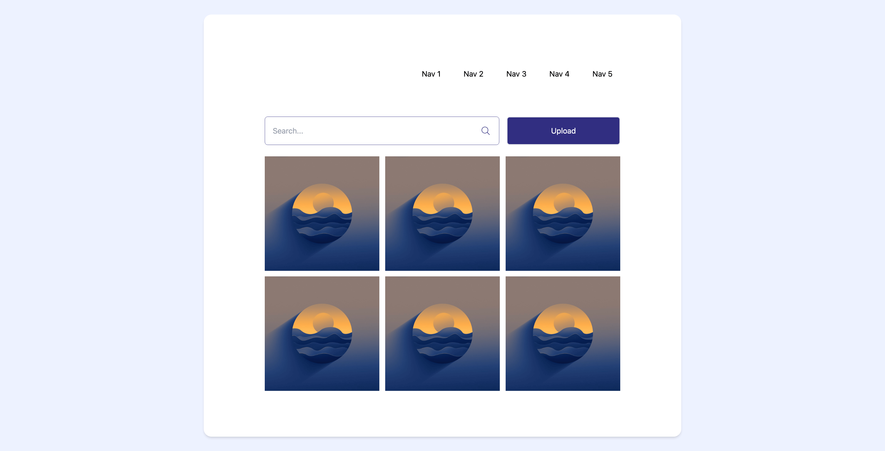
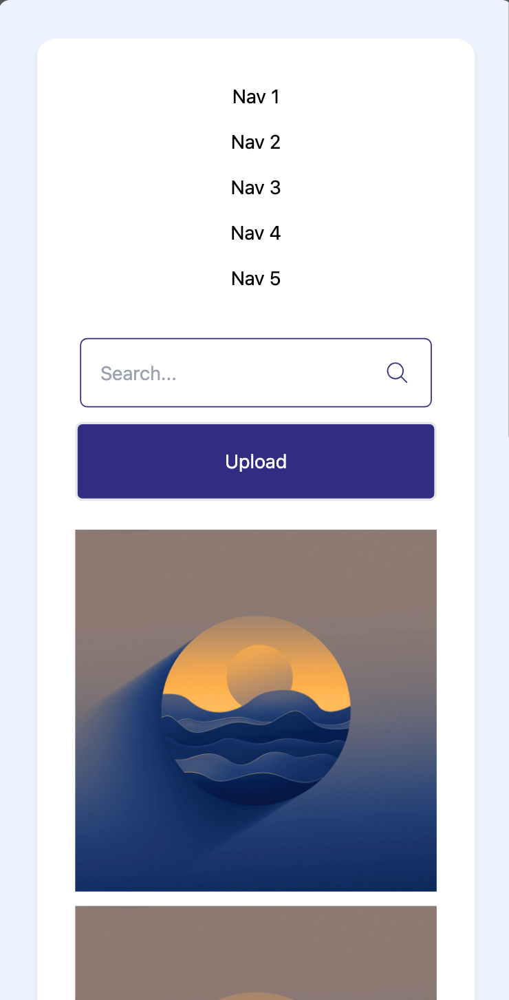

# Tailwind Mini Projects

This repository contains five simple pages built with Tailwind CSS, showcasing various components and layouts.

## Getting Started

This monorepo project is managed by pnpm, so you must install pnpm first.

```bash
# Install all dependencies
pnpm i
# run dev server
pnpm dev
```

## Pages Screenshot

|                    | Desktop                               | Mobile                                |
| ------------------ | ------------------------------------- | ------------------------------------- |
| Email Subscription |  |  |
| Pricing Plans      |  |  |
| Product Modal      |  |  |
| Image Gallery      |  |  |
| Login Modal        |  |  |
